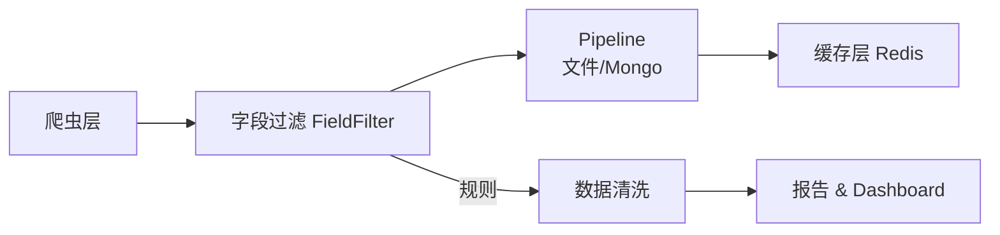

# 文档首页

  
Medpeer · 数据建设组

  <h1>Python 技术文档库</h1>
  

    围绕爬虫、数据清洗与运维部署打造的一站式知识库，涵盖工程架构、API 参考、自动化脚本与团队最佳实践，帮助成员在数分钟内定位需要的信息。
  

  

    [进入项目库](projects/index.md){ .md-button .md-button--primary }
    [查阅开发指南](guide/index.md){ .md-button }
    [查看 API 索引](api.md){ .md-button }
  

  
2 大重点项目

  
9 篇项目章节 × 2 套

  
mkdocstrings + Mermaid 动态渲染

## 推荐入口

  <a class="overview-card" href="projects/rcsb_pdb/architecture/">
    <h3>RCSB PDB 架构设计</h3>
    
分层爬虫 + Pipeline + Redis 的全链路描述，含部署与扩展建议。

    <ul>
      <li>采集、裁剪、存储、状态层的协同方式</li>
      <li>Scrapy / FieldFilter / Pipeline 之间的数据传递</li>
      <li>Playwright 中间件与日志、缓存策略</li>
    </ul>
  </a>
  <a class="overview-card" href="projects/ntrt/architecture/">
    <h3>NTRT 架构设计</h3>
    
数据清洗流水线、任务计划和 ORM 封装的整体视图。

    <ul>
      <li>DataCleaner 主流程与 cleaning_plan</li>
      <li>BaseCRUD / session_dict 抽象，支持多库切换</li>
      <li>批量处理、任务拆分与调度集成建议</li>
    </ul>
  </a>
  <a class="overview-card" href="reference/update/">
    <h3>参考文档 · 更新日志</h3>
    
集中查看全站更新记录、通用术语及支撑工具说明。

    <ul>
      <li>文档版本历史、发布节奏</li>
      <li>新增模块与改动概览</li>
      <li>参考资料与公共资源指引</li>
    </ul>
  </a>

## 最近更新

???+ note "2025-01 · 文档体系升级"
    - NTRT 项目重新编写 9 篇章节，统一 mkdocstrings API 引用。
    - 新增导航分层样式、首页 Hero、概览卡片与指标视图。
    - 集成 Mermaid、pymdownx 系列扩展，提供图表与高级排版能力。

??? tip "2024-12 · 代码清洗主线成型"
    - `DataCleaner` 主流程、`CleaningModelMixin`、`BaseCRUD` 封装落地。
    - 提供 JSON 示例、数据清洗流程说明书，支持多数据库切换。

## 图形与演示

可直接在 Markdown 中编写 Mermaid 以展示架构、流程或时序图：

## 操作指南

1. 在 `MkDocs_doc` 目录运行 `mkdocs serve` 预览站点。
2. 文档位于 `docs/` 目录，必要时同步 `mkdocs.yml` 导航或 `extra_*` 配置。
3. 使用 `mkdocs build` 生成静态资源，可部署至 GitHub Pages、Cloudflare Pages、Vercel、阿里云 OSS 等任意静态托管环境。
4. 若新增项目，请在首页「项目资产」卡片补充描述，保持体验一致。

> 若需要更多交互组件，可参考 `mkdocs.yml` 中启用的 `pymdownx.*` 扩展，或在 `stylesheets/theme-overrides.css` 内追加定制样式。
